# RSNA-Screening-Mammography-Breast-Cancer-Detection

----

## Table of Contents
* src
  * [00_extract_xrays](./src/00_extract_xrays)
  * [01_cleanup_eda](./src/01_cleanup_eda)
  * [02_preprocessing](./src/02_preprocessing)
  * [03_modeling](./src/03_modeling)

## Problem Statement
The Radiological Society of North America (RSNA) hosting a competition  to improve patient care and health care delivery through eduction, research and technological innovation. The goal of this competition is to identify breast cancer with screening mammograms obtained from regular screening.

Based on WHO findings, breast cancer is the most common type of cancer occurring worldwide. In 2020 alone, there were 2.3 million new breast cancer diagnosis and 685,000 deaths. Even though breast cancer dropped in high income countries by 40% since 1980s after health authorities implemented regular mammography screening in age group considered risk group, there is still work to be done.

Early detection and treatment are critical to reduce fatalities. Improving the automation of detection in screening mammography may improve accuracy and efficiency of diagnosis, improving the quality and safety of patient care, and help to reduce costs of unnecessary medical procedures.

Baseline:
- Density Baseline: 53/47
- Cancer Baseline: 97.9/2.1

## Audience
The competition host, the Radiological Society of North America (RSNA) is a non-profit organization that represents 31 radiologic subspecialties from 145 countries around the world. RSNA promotes excellence in patient care and health care delivery through education, research, and technological innovation.

## Python Libraries
Following python libraried were used during the project:
- `pandas`
- `numpy`
- `seaborn`
- `matplotlib`
- `sklearn`
- `tensorflow`
- `pydicom`
- `scipy`
- `skimage`
- `imblearn`

## Datasets
Radiological Society of North America (RSNA) provided anonymized patients meta data and mammogram in `dicom` format. There are roughly 8000 patients and usually 4 mammograms per patient. 
## EDA
Cancer Correlation
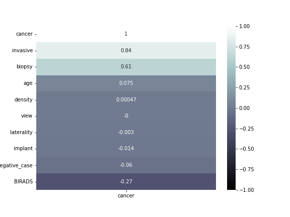

CAll Correlation
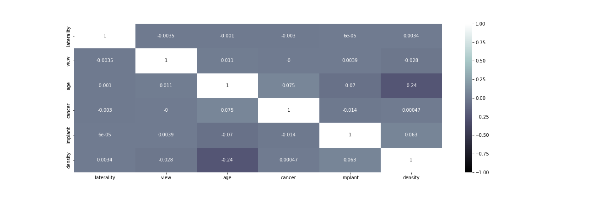

Total Classifications
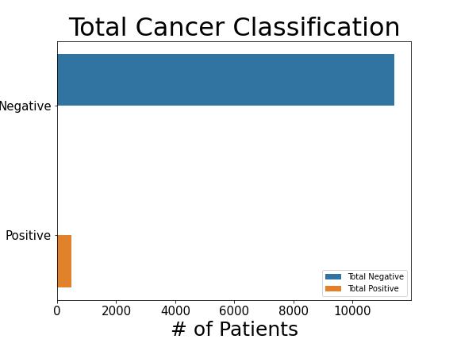

Cancer distribution By Age
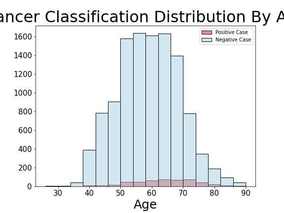

Positive Cancer Dist
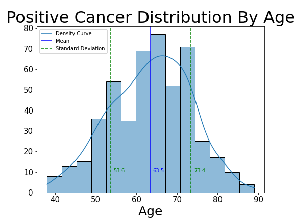

Left CC View Of Breast
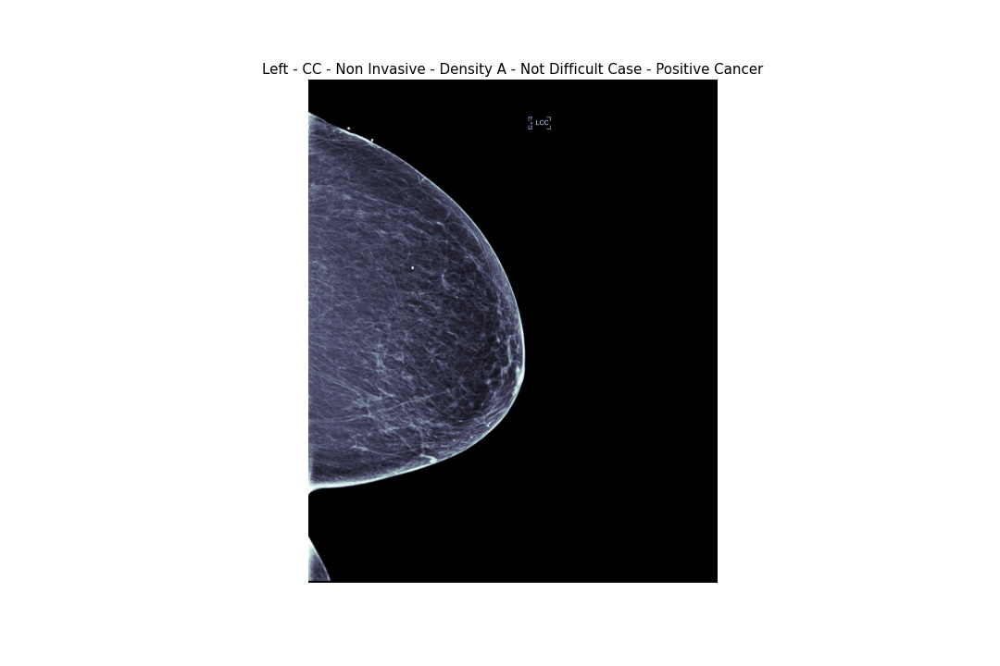

Breast Density C View CC
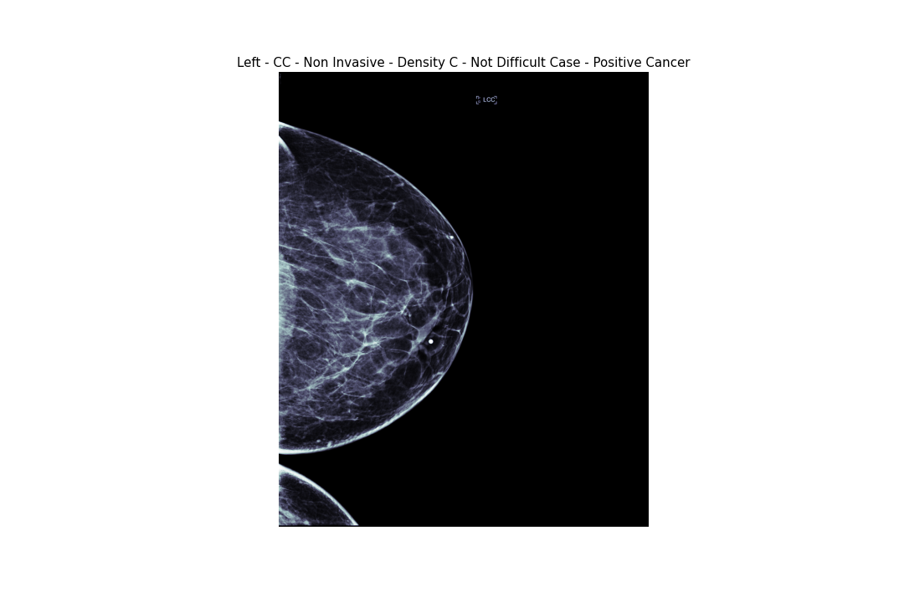

Gradient Heatmap for XCEPTION model
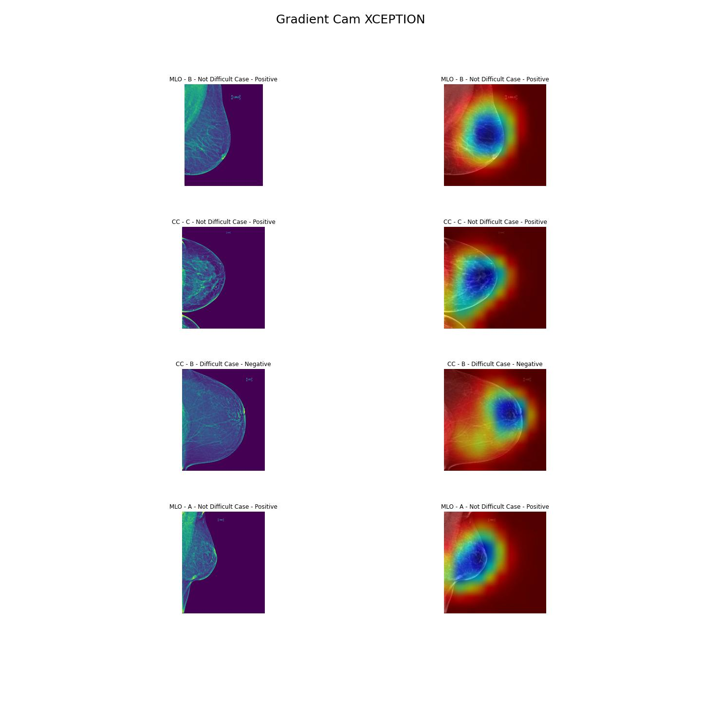

## Modeling
Based on American Cancer Society adding density into your model improves the classification performance for cancer. The dataset I have collected had 50% missing density and I have built CNN+MLP (Mixed Dataset) model which can be used for `density` and `cancer` classifications.

Density classification contained 4 different rating `{A, B, C, D}`, `A` being the least dense and `D` being the most dense. I have grouped A and B to group `Not Dense`, C and D to group `Dense` to prepare for my modeling. Baseline for density I had roughly 53% of training dataset being `Not Dense`. Training the model validation AUC=85%, and after adjusting threshold to 0.1 AUC improved to 86% where total (Type-I: 106) and (Type-II: 44) out of 1000 patients. This adjustment was necessary since it is important for model to provide less Type-II errors since `Dense` density is harder to detect cancer in mammogram.

Cancer classification required more in depth work since it was highly imbalanced 97% of total patient dataset being negative cancer diagnosis. I have picked two routes to solve this issue:
- Under Sample:
  - Model train/test: 0.50/0.46 accuracy with f-1 score of 0.54

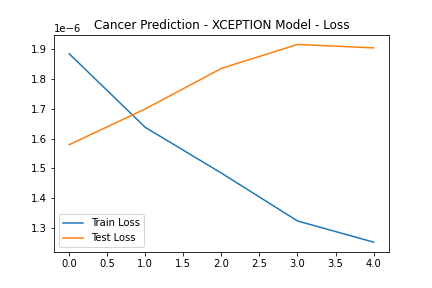

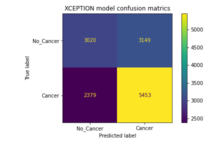

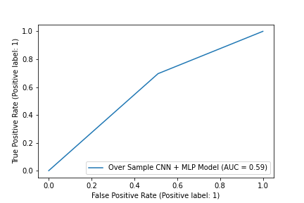

- Over Sample:
  - Model train/test: 0.98/0.85 accuracy with f-1 score of 0.61

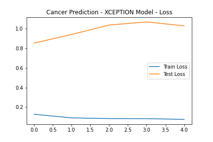

## Conclusion & Recommendation
Dataset contained BIRADS feature which was not utilized due to time constraint. Working with imbalanced dataset presented difficulties on preparing data for modeling. Under sampling data was not helpful since model is not learning as much compared to Over sampling. I recommend adding more hidden layer, adjust learning rate, add random dropouts and test with different models to check the differences.

## References
[American Cancer Society](https://www.cancer.org/cancer/breast-cancer/screening-tests-and-early-detection/mammograms/breast-density-and-your-mammogram-report.html)

[National Library of Medicine](https://www.ncbi.nlm.nih.gov/pmc/articles/PMC6113143/#CR11)

[RSNA Radiology](https://pubs.rsna.org/doi/full/10.1148/radiol.2019182716)

## Data Dictionary

| Features                | Data Types | Description                                                                                                                                                                              |
| ----------------------- | ---------- | ---------------------------------------------------------------------------------------------------------------------------------------------------------------------------------------- |
| patient_id              | int        | ID code for the patient.                                                                                                                                                                 |
| image_id                | int        | ID code for the image.                                                                                                                                                                   |
| laterality              | string     | Whether the image is of the left or right breast.                                                                                                                                        |
| view                    | string     | The orientation of the image. The default for a screening exam is to capture two views per breast.                                                                                       |
| age                     | int        | The patient's age in years.                                                                                                                                                              |
| density                 | int        | A rating for how dense the breast tissue is, with A being the least dense and D being the most dense. Extremely dense tissue can make diagnosis more difficult. Only provided for train. |
| invasive                | int        | If the breast is positive for cancer, whether or not the cancer proved to be invasive. Only provided for train.                                                                          |
| difficult_negative_case | boolean    | True if the case was unusually difficult. Only provided for train.                                                                                                                       |
| cancer                  | int        | Whether or not the breast was positive for malignant cancer. The target value. Only provided for train.                                                                                  |